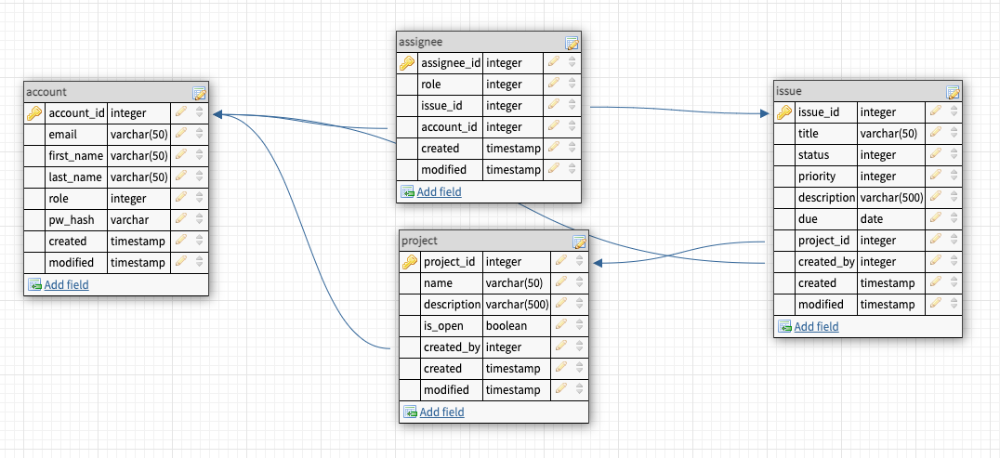

<h1 align="center">
   
  
</h1>

<h4 align="center">Java JSF Issue and Project Web Application.</h4>

  <a href="#key-features">Demo</a> •
  <a href="#how-to-use">Live Site</a> 

---
## Table of Contents
- [Introduction](#intrduciton)
- [Description](#description)
	- [Features](#features)
	- [Database Design](#database-design)
	- [MVC Structure](#mvc-structure)
- [Technologies](#technologies)
    - [Built With](#built-with)
    - [Why](#why)
- [Future Features](#future-features)
- [Author](#author)
    - [Socials](#socials)

---
## Introduction
**Tracker** is a full stack web application created in the spirit of many project management applicaiton services like Jira.

Displaying an understanding of the fundamentals of both code development and the operational functions as a developer were the core of this project.

---
## Description
Tracker is a full-stack java application that replicates many project management applications (i.e. JIRA). The program consists of three key components: a login/account creation component, a projects component, and a issues/bug component. The program allows for users to create an account setting their desired role (eg. Developer, Tester) within the application. The user can then create, update, and view Projects and create, update and view Issues/Bugs. Searching and filtering for issues/bugs is a main use case that allows for the in-depth searching of issues/bugs that meet user-selected criteria.  It was this issue/bug filtering that proved to be the biggest development challenge.  This challenge was resolved through the use of a filter class to encapsulate the filter request as well as leveraging the JPA query capabilities to implement the filtering action itself.

#### Use Cases
- Create, update, view and delete user account.
- Create, update, view and delete project.
- Create, update, view and delete issues/bugs.
- Classify issues/bug types, severity, and status.
- Search/filter for issues based on type, severity, and status.
- Browse for project.

#### Database Design

#### MVC Structure
A quick look at the MVC structure of this project.

        ├── README.md
        ├── code-format.xml
        ├── pom.xml
        ├── readme_assets
        ├── src
        │  ├── main
        │   ├── java
        │   │   └── com
        │   │       └── jentrent
        │   │           └── tracker
        │   │               ├── dao
        │   │               ├── model
        │   │               ├── service
        │   │               └── view
        │   ├── resources
        │   └── webapp
        └── test
 

---
## Technologies
**Built With**  
Java • JSF • PrimeFaces • Spring • Hibernate • PostgreSQL • Heroku

**Why**  
<table>
  <tr>
    <td nowrap><strong>JSF</strong></td>
    <td>Popular component-centric framework that eases the development of Java web applications.</td>
  </tr>
  <tr>
    <td nowrap><strong>PrimeFaces</strong></td>
    <td>A great third-party UI that adds a nice aesthetic to the user interaction.</td>
  </tr>
</table>

	
---
## Future Features

- Functionalities
	- Comments/note
	- Email Notification	
- Further Rest API configurations.
- Styling updates.

---
## Author: Jennifer Trent
_Website_: www.jentrent.com  

**Socials** 
 

---
